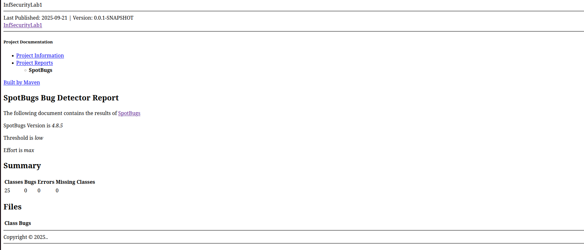
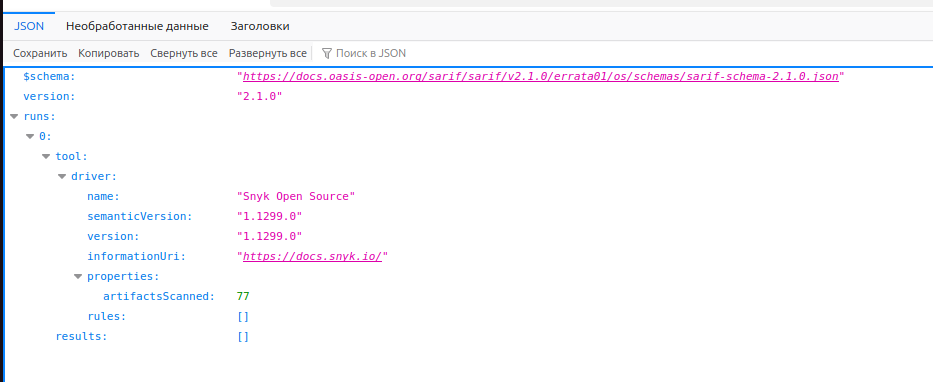
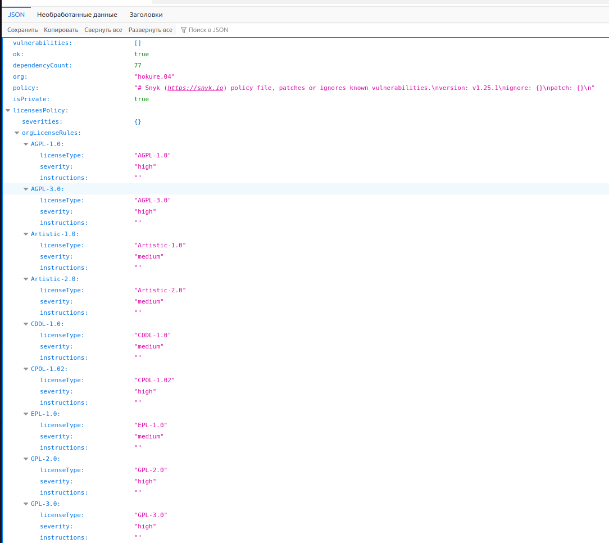
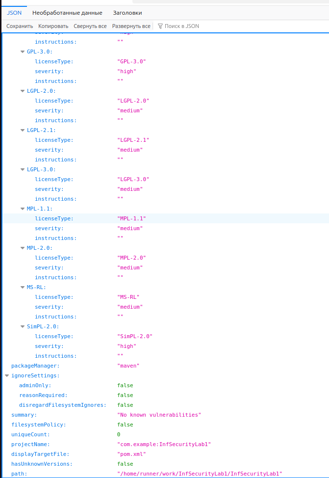

# Работа 1: Разработка защищенного REST API с интеграцией в CI/CD
___

Выбранный стек: Java/Spring Boot, для сборки проекта был выбран maven  
Для данной лабораторной было разработано безопасное backend-приложение с автоматизированной проверка кода на уязвимости  

### Разработанные эндпоинты
___

`POST /auth/sign-up` - метод для регистрации пользователя  
Может быть использован не аутентифицированными пользователями  
Пример вызова: 

```
curl --location 'localhost:8080/auth/sign-up' --header 'Content-Type: application/json' --data-raw '{
    "firstName":"Kargin",
    "lastName":"Alexander",
    "password":"supersecret1234",
    "email":"somemail@gmail.com"
}'
```

`POST /auth/login` - метод для аутентификации пользователя  
Доступен только для аутентифицированных пользователей  
Пример вызова:

```
curl --location 'localhost:8080/auth/login' \
--header 'Content-Type: application/json' \
--data-raw '{
    "email": "somemail@gmail.com",
    "password": "supersecret1234"
}'

```

`GET /api/data` - метод для получениях данных о пользователях зарегестрированных в системе  
Доступен только для аутентифицированных пользователей  
Пример вызова:  

```
curl --location --request GET 'localhost:8080/api/data' \
--header 'Content-Type: text/plain' \
--header 'Authorization: Bearer some_jwt' \
--data-raw '{
    "firstName": "Sasha",
    "lastName": "Kargin?",
    "email": "somemail@gmail.com",
    "password": "securepassword123"
}'

```

`POST /admin/promote/{id}` - метод для повышения роли пользователя до администратора  
Доступен только для пользователей с ролью ROLE_ADMIN  
Пример вызова:

```
curl --location --request POST 'localhost:8080/admin/promote/2' \
--header 'Authorization: Bearer some_jwt'

```

`POST /admin/block/{id}` - метод для блокирования пользователя  
Доступен только для пользователей с ролью ROLE_ADMIN  
Пример вызова:  

```
curl --location --request POST 'localhost:8080/admin/block/3' \
--header 'Authorization: Bearer some_jwt'

```

### Меры защиты
___

1. Аутентификация  
При успешной регистрации или авторизации генерируется JWT токен, при обращений к запросам требующим от пользователя аутентификации запрос, обрабатывается в классе `JwtAuthenticationFilter`, который проверяет его корректность и подлиность.  
2. Защита от SQLi (SQL-инъекций)  
Для работы с базой данных PostgreSQL используется ORM Hibernate, который вместо отправки прямых SQL-запросов, создаёт параметризированные запросы к БД 
3. Защита от XSS  
Экранирование пользовательских данных при приёме и выводе, реализовано с помощью функции `StringEscapeUtils.escapeHtml4()`
4. Защита паролей  
Все пароли сохраняются в базу данных в защищенном виде, с помощью алгоритма BCryptPasswordEncoder  

### Отчёты SAST/SCA
___
Скрины отчётов взяты с последнего успешно пройденного пайплайна: [Успех](https://github.com/Hokure04/InfSecurityLab1/actions/runs/17931556477)

Отчёт от SpotBugs:
  
Во время разработки были найдены и устранены следующие уязвимости:  
`EI_EXPOSE_REP2` - класс хранил ссылку на изменяемый объект в поле, что в потенциале могло привести к непридведенным последствиям, ечли объект будет изменён извне.  
`SE_NO_SERIALVERSIONUID` - уязвимость, означающая отсутствие поля serialVersionUID в сериализуемом классе, рекомендуется явно объявлять serialVersionUID, т.к. при существенных изменениях класса уже сериализованный класс не сможет быть восстановлен, потому что будет создан новый serialVersionUID.  


Отчёт от Snyk:


  
При использовании библиотеки commons-lang3 версии 3.17.0, была обнаружена уязвимость `CVE-2025-48924`, которая означает, что при обработке очень длинных входных данных метод, может вызвать ошибку StackOverflow. В 18 версии данная уязвимость исправлена.
